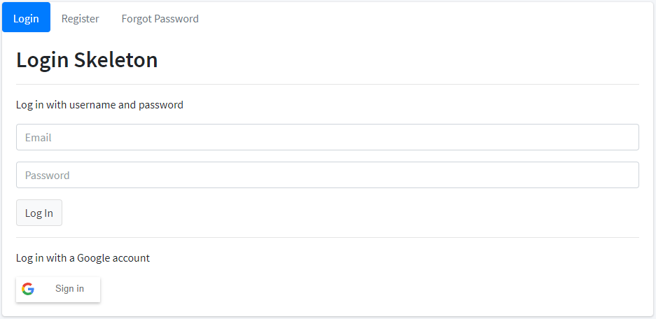

# shinylogin

<!-- badges: start -->
[](https://lifecycle.r-lib.org/articles/stages.html#experimental)
<!-- badges: end -->

shinylogin wraps shiny and bs4Dash to provide user login and registration functionality as a front screen before access is permitted to an R Shiny app. It also creates a user management panel within the app.

WARNING: shinylogin is experimental and I'm not a security specialist. It will ensure that casual users log in before they can access your app and implements basic security good practices such as encrypting stored passwords & preventing SQL injection, but it's unlikely to survive an attack from a hacker who knows what they're doing.

If you need robust application security, please investigate [shinyapps.io](https://www.shinyapps.io/) paid tiers or RStudio Connect.

shinylogin is close to being useable but still has big gaps and will almost certainly see more breaking changes.

## Installation

``` r
remotes::install_github("neilcharles/shinylogin")
```

---



---

## Features

- App login with username and password, plus the option to include authentication using a Google account

- Optional in-app user registration or restriction to pre-registered users only

- Forgotten password recovery via email

- Passwords stored as hashes in the user database using the sodium package

- SQL injection prevention

- Option to set privilege levels for individual users

- Easy setup via an RStudio project template extension

- Attractive bs4Dash user bar and logout function once logged in

- Easy retrieval of logged in user details for use within your app

- Option to specify a database connection to store user details, or let shinylogin default to local storage

## Getting Started

Once you have installed the shinylogin package, in RStudio create a new project with
- *File > New Project > shinylogin Project*

shinylogin will then create a working minimal example project.

Run *app.R* as you normally would with a shiny app.

You will see three shinylogin files at the top level of the project directory.
- *shinylogin_server.R*
- *shinylogin_ui.R*
- *shinylogin_sidebar.R*

These files should be used to write your app code and are called by *app.R*,
which keeps your own code separate from the login workflow. You probably don't want to edit *app.R* in normal 
use of the shinylogin package.

shinylogin uses [bs4Dash](https://rinterface.github.io/bs4Dash/index.html) so the app UI code that you write
should be designed to fit within *bs4DashPage()* and *bs4DashSidebar()* functions. Your code will be inserted into these functions by shinylogin.

It is recommended that you have at least a little knowledge of bs4Dash before trying to write code for shinylogin.

## Google Authentication

Guide coming soon

## shinylogin Options

Guide coming soon

## Forgotten passwords and smtp authentication

Guide coming soon
